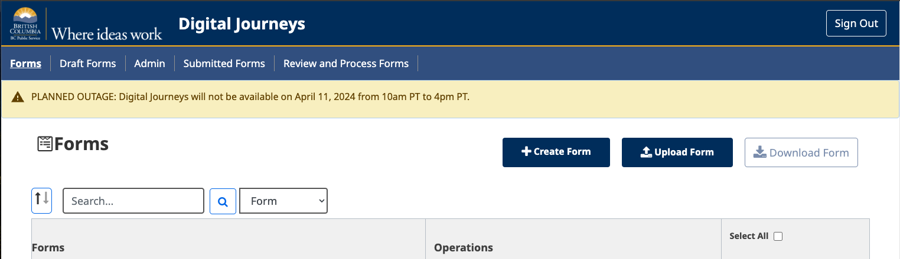

# Alert Banner
It will give a context to how a `developer` and a `form designer` can manage Alert Banner on the system. It will not limit only to the alert banner. *If management wants to display some important message in the banner, we can use the same feature.*

>**How it will work?**
The `developer` or `form designer` needs to utilize the active session authentication token and the provided JSON file format to add a new `Alert Banner` in the system using the available APIs.


## Available API endpoints
Alert banner endpoints are available under the web-API URL.
- `/alert-note`
	- It will use to create/list alert banners in the system.
	- It supports `POST` and `GET` methods. (Note, the PUT method is not implemented. It can add in a future version).
- `/alert-note/active-note`
	- It supports the `GET` method and pulls an active alert banner.
	*It will pull only one alert banner at a time, ordered by created time in ascending order.*


## Operations
### Add alert banner
Add a new alert banner.  
**Endpoint** : POST /alert-note  
**Header** : { "Authorization": "Bearer < *FORM DESIGNER TOKEN* >" }  
**Body**: A json object.
- content: Alert banner content, It can be string or HTML string
- contenttype: Please specify the type of alert you wish to display:
	- Red: Indicates danger.
	- Yellow: Indicates information or warning.
	- Green: Represents any general message.
	
	For further information, please refer to [Bootstrap alerts]((https://getbootstrap.com/docs/4.0/components/alerts/)).
- contentdata: It indicate type of content, HTML or Form(here form format is not implemented) .
- start_date: Start Date and time to display alert (in UTC).
- end_date: End Date and time to hide alert (in UTC).

Example:
```
{
    "content" : "PLANNED OUTAGE: Digital Journeys will not be available on April 23 from 9:15 am PT to 10 am PT.",
    "contenttype" : "alert alert-info",
    "contentdata" : "html",
    "start_date" : "2024-04-23T16:15:00+00",
    "end_date": "2024-04-23T17:00:00+00"
}
```

### Fetch active **Alert Banner**
Upon opening the website or loading the page, an active alert banner can be retrieved based on the date and time. If no active alert banner is found for the specified date and time, a 404 (not found) error will be returned.  
**Endpoint** : GET /alert-note/active-note 
**Header** : { "Authorization": "Bearer < *USER TOKEN* >" }  

### Example




### Update Alert banner details
Please connect to the WebAPI PostgreSQL database and manually update the `alert_note` table accordingly. For connection instructions, please refer to the information provided [here](../cleanup-environment.md)


## Future enhancement
Currently, there is no frontend developed for managing alert banners. Below is a list of features that can be reviewed, and required features can be selected for implementation. It is not necessary to add all the features/points:
- Add an API to modify any alert banner at any time.
- Implement a new frontend to display a list of all alert banners.
- Create a page where alert banner data can be uploaded without requiring developer intervention. This functionality will be accessible only to users with the DESIGNER role.
- Allow users to delete any alert banners from the list.
