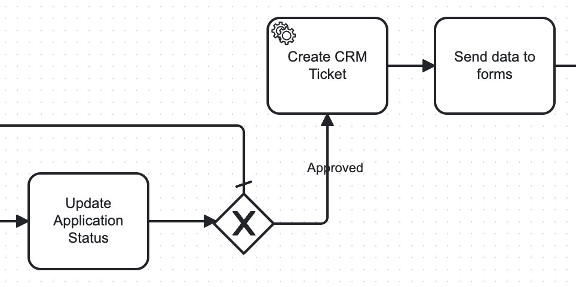
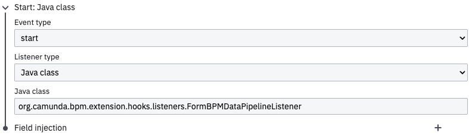
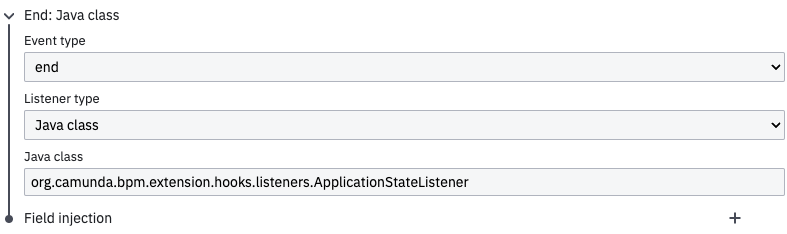
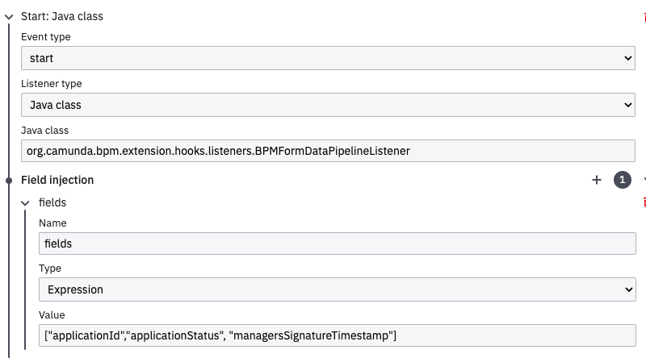
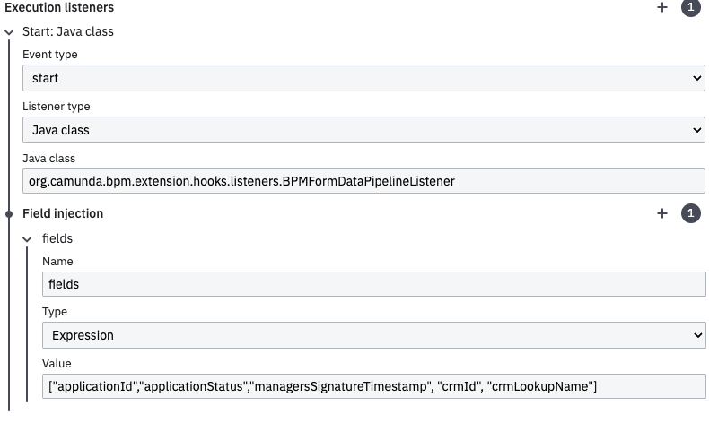
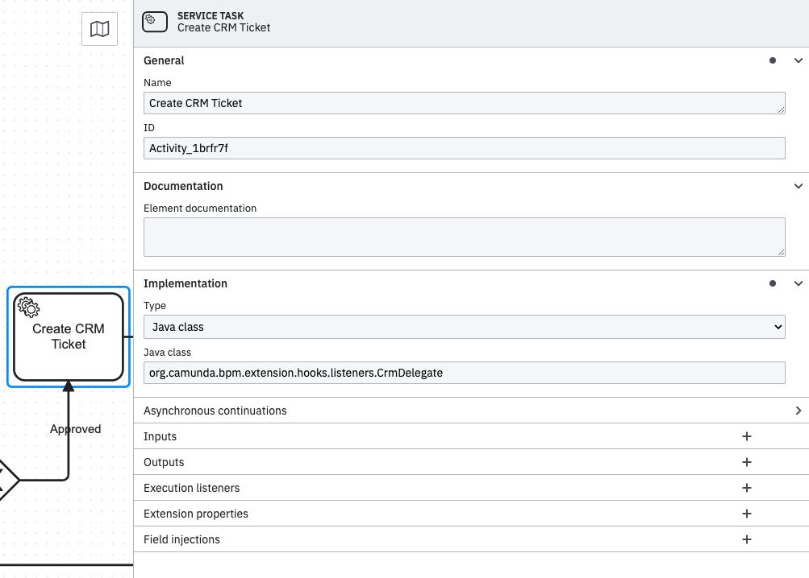

# CRM Ticket Creation Guide

This README file provides instructions on how to create a CRM ticket using the provided hidden form fields. Each hidden form field plays a crucial role in defining the details and context of the ticket. Additionally, you will need to add a task in the Camunda workflow in the specified manner.

>**Important** : For the primary contact in CRM tickets, we collect IDIRs from active users' sessions in the Mat/Pat and COi forms, specifically from supervisors.

### **Parameters**
- **crmProductLookupName** : The name of the product related to the ticket.
- **crmCategoryLookupName** : The category of the ticket for better classification.
- **crmStaffGroupLookupName** : The name of the staff group handling the ticket.
- **crmSubject**: The subject or title of the ticket. Add CRM subject line as `crmSubject + " for " + submitterDisplayName`
- **crmIncidentSubject** : If you want to modify the subject line based on your requirements, you can use this field to create a dynamic subject line incorporating form data or other details.
- **crmLookupName** : A general lookup name used to reference other CRM entries. Default it will be blank.
- **crmId** : A unique identifier for the ticket. Default it will be blank.
- **crmFileFields** : Fields related to any files attached to the ticket from the form. By default, it should display file names separated by commas. If you want to provide dynamic or static names, attach the name to the file using a colon (:).

*Example script*
```
/* let's say we have three component with file attachments, employeeFieldOne, employeeFieldTwo, SupervisorField */

value = "";
let files = [];
let fields = [
    "employeeFieldOne",
    "employeeFieldTwo",
    "SupervisorField"
  ];
fields.forEach(element => {
  if (data.hasOwnProperty(element) &&
    data[element].length > 0 && 
    data[element][0]?.name !== undefined &&
    data[element][0].name !== "" &&
    data[element][0].name !== null
  ) {
    if (element === 'SupervisorField')
      files.push(element + ":SupervisorFile");
    else
      files.push(element);
  }
});
value = files.join(",");
```
- **crmFormPDFAttachmentName** : The name of any Form PDF attachments included in the ticket.
- **crmThreadText** : Text for the conversation or thread related to the ticket. It is HTML format.
- **submissionDisplayName** : This is a general-purpose parameter. It will be used to display the employee name in drafts and application lists during the digital journey. Additionally, we use it to fetch the display name in the CRM for the subject line.
- **managerDeniedStatus** : This status indicates whether a manager has denied the ticket or any associated requests. If the `action` parameter value matches this status, CRM ticket creation will be skipped.
- **empId** : EmpId is the employee ID of the person who submitted the form. This field is optional, but if provided, it must be a valid employee ID; otherwise, the ticket will not be created. If a valid employee ID is provided, it will be used to add a secondary contact to the CRM ticket.

Example
```
  "crmProductLookupName": "ProductA",
  "crmCategoryLookupName": "Technical Support",
  "crmStaffGroupLookupName": "SupportTeam",
  "crmSubject": "CRM Form",
  "crmIncidentSubject": "CRM form RE: John Doe",
  "crmLookupName": "240515-000007",
  "crmId": "12345678",
  "crmFileFields": "employeeFieldOne,employeeFieldTwo,SupervisorField:SupervisorFile",
  "crmFormPDFAttachmentName": "error_report.pdf",
  "crmThreadText": "<p>Initial report of the issue by user.</p>",
  "submissionDisplayName": "John Doe",
  "managerDeniedStatus": "Denied"
  "empId": 123456
```


### **Workflow**
Below image shows the tasks required to create a CRM incident.


Both default tasks, `Update Application Status` and `Send Data to Forms` are mandatory for accurately transferring data between the Camunda and form databases.

#### *Update Application Status*
Add three `Execute listners`.




#### *Send data to forms*
Add one `Execute listners`. Make sure you pass `crmId` and `crmLookupName` as those fields are update in workflow and needs to send to formio database.


#### Create CRM ticket
Here, a service task is required, and only one method, 'CrmDelegate,' needs to be implemented. Please refer to the image below for details.
