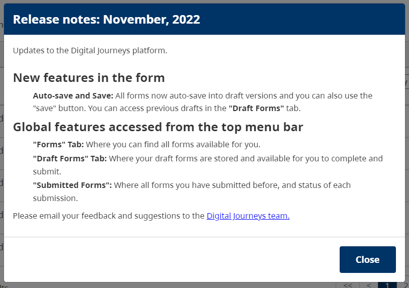

# Release Note
It will give a context to how a `developer` and a `form designer` can manage release notes on the system. It will not limit only to the release note. *If management wants to display some important message in the popup, we can use the same feature.*

>**How it will work?**
1. A `form designer` needs to create a release note using a `form builder` and provide that form file to the `developer`.
2. A `developer` needs to use the JSON file provided by the `form designer` and add a new release note in the system using available APIs.

##Available API endpoints
Release note endpoints are available under the web-API URL.
- `/release-note`
	- It will use to create/update/list release notes in the system.
	- It supports `POST` and `GET` methods. (Note, the PUT method is not implemented. It can add in a future version).
- `/release-note/unread`
	- It supports the `GET` method and pulls an unread release note for the logged-in user.
	*It will pull only one release note at a time.*
- `/release-note/read`
	- It supports the `POST` method and marks read the displayed release note.

## Operations
### Add release note
Add a new release note.
**Endpoint** : POST /release-note
**Header** : { "Authorization": "Bearer < *FORM DESIGNER TOKEN* >" }
**Body**: A json object.
- title: Release note title / Message title.
- content: < formio `form object` >
	- When we export form, it will export in json format and it contains one key **forms**. It is an array and the first object of this array is a `form object` that we have to pass here. The form .json file will look like this . `{ "forms": [ {<form details>} ] }`.

### Modify release note
No separate API was built to update details in the release note. Because new changes must be visible to all the users again. We will add a new release note with the updated content and mark the old release note as inactive.
**Endpoint** : POST /release-note
**Header** : { "Authorization": "Bearer < *FORM DESIGNER TOKEN* >" }
**Body**: A json object.
- *title: Release note title / Message title*.
- *content: < formio `orm object` >*
- **release_note_id: < old release note id >**
	- Old *release note id* can be fould using **list release note**.

### List release notes
It will list all the active release notes.
**Endpoint** : GET /release-note
**Header** : { "Authorization": "Bearer < *FORM DESIGNER TOKEN* >" }

### Fetch unread release note
One unread and active release note can be retrieved based on the user token. It will return 404 (not found) if no unread release note is found for the logged-in user.
**Endpoint** : GET /release-note/unread
**Header** : { "Authorization": "Bearer < *USER TOKEN* >" }

### Mark read release note for user
It will mark release note read for the logged-in user.
**Endpoint** : POST /release-note/read
**Header** : { "Authorization": "Bearer < *USER TOKEN* >" }
**Body**: A json object.
- release_note_id: Release note id that will mark read for the logged-in user.

## How to add Release note
Let&apos;s understand the role of the designer and developer here in detail. Please go to the example section to see the sample release note .json and how it will be displayed on the web page.

### Form Designer
- The form Designer needs to go to the **Create Form** page and design HTML content for the release note using the formio builder.
- Once the Form was designed, Go to the form list tab, select the release note form and click on **Download Form**. It will download one JSON file. That needs to pass on to the **developer**.
- It can be create on any lower environment like `DEV` or `TEST`.
	 **Notes**
	- The form name is not important, So feel free to pick any unique name or title here.
	- No need to keep the created release note once you export the form&apos;s JSON and share it with the developer.
	- To edit release notes, One can use the `upload form` feature on the form tab. Edit the required details and share them with the developer again to update the release note table.
	- In the form builder, there is a provision for the custom class. So if you want to change any style like space between lines, header design, font size, etc. The designer can coordinate it with the developer and find an existing style class for it or the developer can add a new style class for the new style requirement.

### Developer
To add a release note in the system. Developers can perform actions like adding, updating, and list release notes. Let&apos;s see how a release note can be added after receiving the .json file from the **form designer**.
- Open **postman** or any API manager tool.
- Follow **Add release note** operations steps.
- In case of modify release note, please follow **Modify release note**.
	- Please collect old release note id using **List release notes**.

## Emample
- If you want to start editing the sample form, Please download it from [here](form-release-note.json). (for designer)
    - Upload it in the form tab by clicking on 'upload form'.
    - Now you can edit it with new content.
    - Download it again and share the same with developer.
- Please find sample add release note json [here](add-release-note.json). (for developer)
- To checkout content of the above JSON file, please see below release-note popup.

## Future enhancement
Currently, there is no frontend developed that is used to manage release notes. The below list can be reviewed and select required features and implements the same. No needs to add all the features/points.
- Add new frontend that will list all the release notes.
- Add a page where you can upload release note data and no need to ask any developer. It will work with the DESIGNER role only.
	- Create/modify component for the release note module separately than the form tab. It will take more time to replicate or use the same components to enable add/edit release note directly on the release-note page and no needs to go to the form tab.
- From the list one can in-active any release notes.
- Extend
	- List users who read the release note.
	- Re-enable a release note for one user by deleting its read entry.
	- Add a release note for the selected users only.
