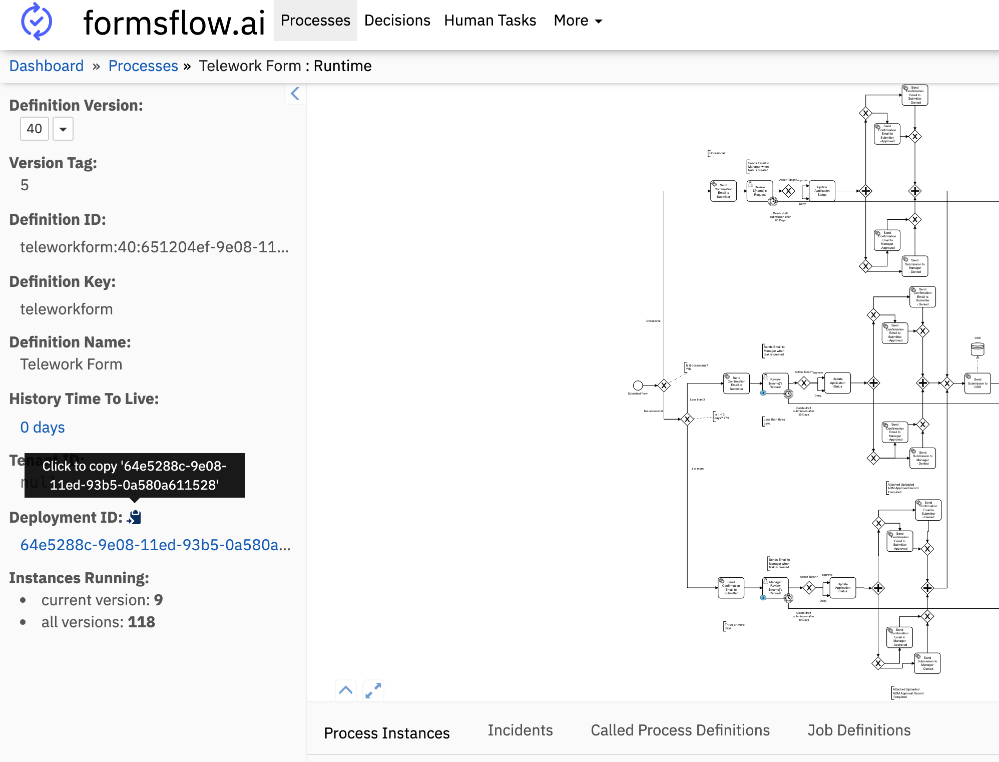
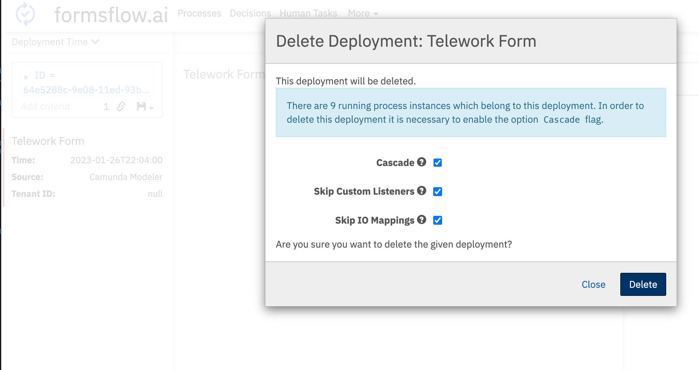

# Cleanup Environment 

This document describes how to clean up an environment (e.g., dev, test, prod) with forms, workflows, submission data, and other artifacts.


## Deleting unused forms on the TOOL (`web`)
As a designer, delete any unused form in form list page. Deleted forms are soft deleted in the db, so you can reference them later if needed.

## Deleting the workflows and submission in `Camunda`
Login to Camunda Admin dashboard as a `camunda-admin`.
1. Go to `Process Definition` page through Cockpit. Select the process definition you want to delete.
2. Once in a process definition page, you can select the Definition Version you want to delete. Then copy the `Deployment ID`.
3. Go to `Deployments` page through Cockpit.
4. Under `Add criteria` section, select `ID` and paste the `Deployment ID` you copied in step 2. Then click enter.
5. click delete button on the found deployment. It will open up a confirmation dialog. Check `Cascade` checkbox and confirm the deletion. It will delete the process definition and all the related data.

If you want to delete all the versions of a process definition, you can search deployment by `Name` instead of `ID`. You need `Definition Name` of the process definition and then search by `Name` in the `Deployments` page.





## Deleting data in the `webApi` Postgres database
The following tables are used by the `webApi` service. You can delete data from these tables to clean up the environment.

  * form_process_mapper: This table is used to map a form to a process definition. A form_process_mapper record can only be deleted if there is no application or drafts associated with it.
  * applications: This table is used to store the application data. application data with `Draft` status have also have a dependency record in `draft` table. To remove such application data, you need to first delete the corresponding record from `draft` table.
  * drafts: This table is used to store the draft data.
  * application_audit: This table is used to store the audit data for application data.

To connect to `webApi` db you need to first log in to the OpenShift CLI and forward the port to the PostgresDB pod `oc port-forward patroni-0 5432`. You can use a relational database client of your choice to connect to the `webApi` database.

Below are some of the queries you can use to clean up data in these tables.

```sql
/* Delete a form_process_mappers with its related data */
delete from draft where application_id in (select id from application where form_process_mapper_id = 45);
delete from application where form_process_mapper_id = 45;
delete from application_audit where application_id in (select id from application where form_process_mapper_id = 45);
delete from form_process_mapper where id = 45;

/************** START ** Delete inactive form_process_mappers along with their related data **************/
/* Delete application_audits of inactive form_process_mappers */
delete from application_audit where application_id in (
	select id from application where form_process_mapper_id in (
		select id from form_process_mapper where status != 'active'
	)
);

/* Delete drafts of inactive form_process_mappers */
delete from draft where application_id in (
	select id from application where application_status = 'Draft' and form_process_mapper_id in (
		select id from form_process_mapper where status != 'active'
	)
);

/* Delete draft applications of inactive form_process_mappers */
delete from application where application_status = 'Draft' and form_process_mapper_id in (
	select id from form_process_mapper where status != 'active'
);


/* Delete applications of inactive form_process_mappers */
delete from application where form_process_mapper_id in (
	select id from form_process_mapper where status != 'active'
);


/* Delete inactive form_process_mappers */
delete from form_process_mapper where status != 'active';

/************** END ** Delete inactive form_process_mappers along with their related data **************/

/* Delete items in application_audit by creation date  */
delete from application_audit where created < '2023-01-01';

/* Delete non-draft applications by modified date */
delete from application
where application_status != 'Draft' AND modified < '2023-01-01';

/************** START ** Delete drafts in draft and application tables by a condition in draft table **************/
/* First clone draft table with no data */
CREATE TEMPORARY TABLE temp_draft AS TABLE draft WITH NO DATA;
/* insert drafts with the condition into the temp_draft table */
INSERT INTO temp_draft select * from draft where modified < '2023-01-01';
/* Delete drafts with condition */
delete from draft where modified < '2023-01-01';
/* Delete applications with draft status that have a condition exist in draft table */
delete from application where id IN (
	select application_id from temp_draft where modified < '2023-01-01'
);
/* Drop temp_draft table */
DROP TABLE temp_draft;
/************** END ** Delete drafts in draft applications tables by a condition in draft table **************/

```

## Deleting data in the `formio` Mongo database
The following tables are used by the `formio` service. You can delete data from these tables to clean up the environment.

  * forms: This table is used to store forms. Deleted forms on the website are soft deleted in this table.
  * submissions: This table is used to store submission data.
  * submissionacls: This table is used to store submission access control data. 


To connect to `formio` db you need to first log in to the OpenShift CLI and forward the port to the MongoDB pod `oc port-forward hamongo-0 27017`. You can use `MongoDB Compass` app to connect to the `formio` database (MongoDB).

Below are some of the queries you can use to clean up data in these tables while in the .

```
/* Deletes soft-deleted forms from forms table */
db.forms.deleteMany({deleted: {$ne:null}})

/*  Delete submissions and submissionacls by modified date */
db.submissions.deleteMany({modified: {$lt:ISODate('2023-01-01')}})
db.submissionacls.deleteMany({modified: {$lt:ISODate('2023-01-01')}})

// Delete submissions and submissionacls by formId
db.submissions.deleteMany({form: ObjectId('6402aeb21268f904ebba2c5d')})
db.submissionacls.deleteMany({form: ObjectId('6402aeb21268f904ebba2c5d')})
```

