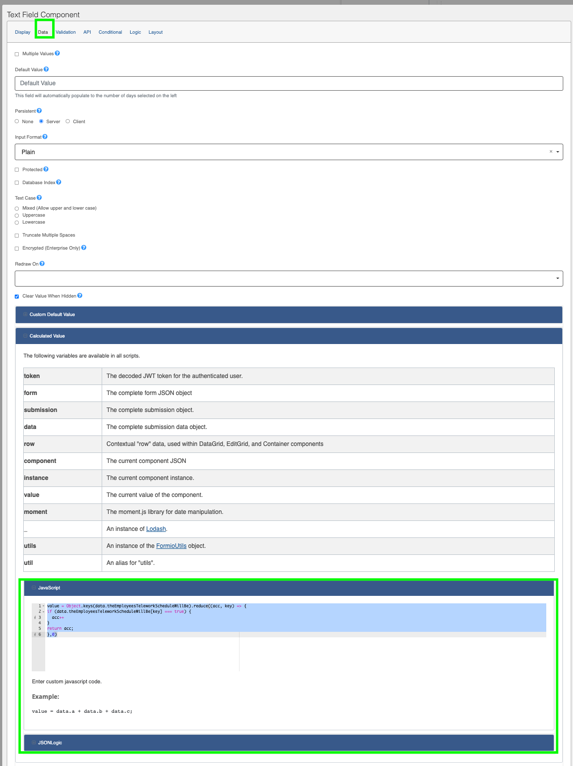
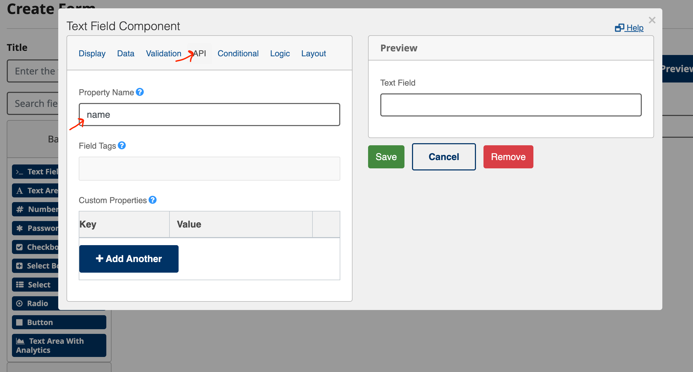
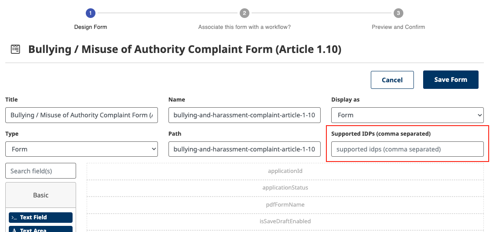
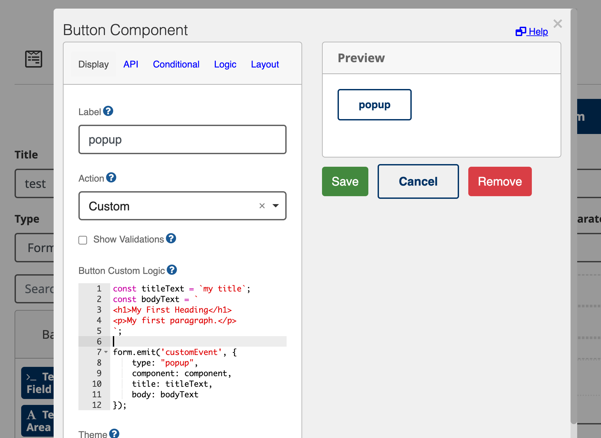
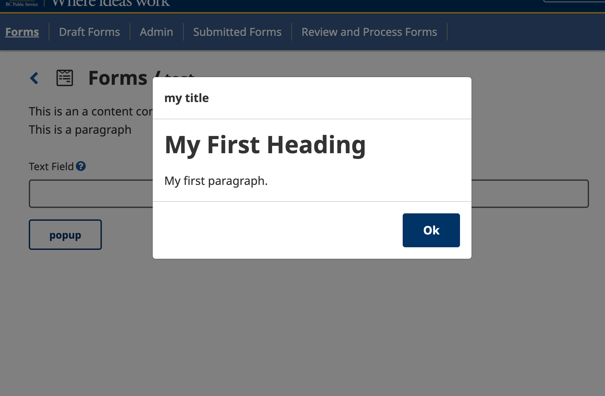
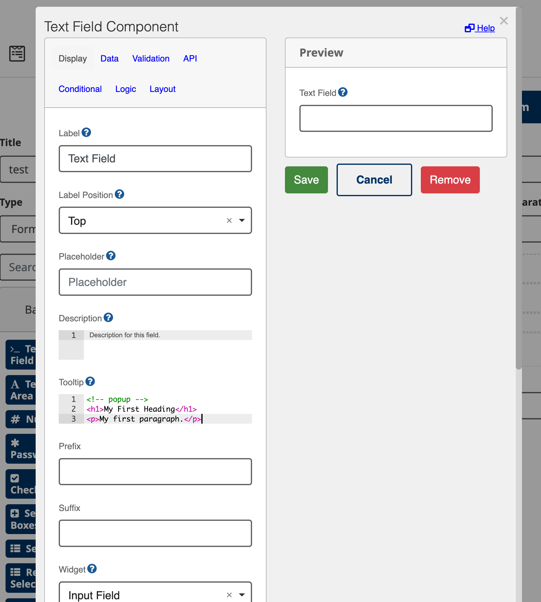
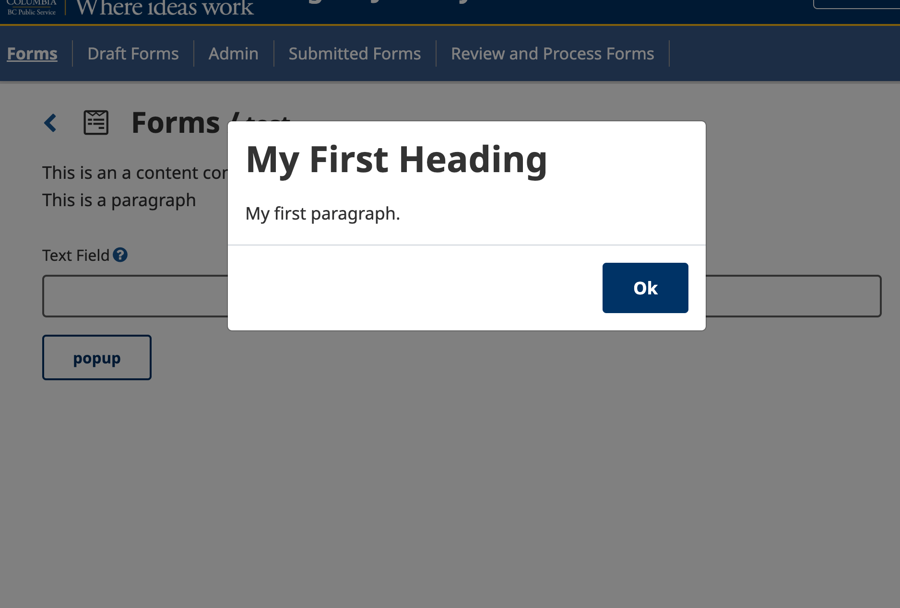
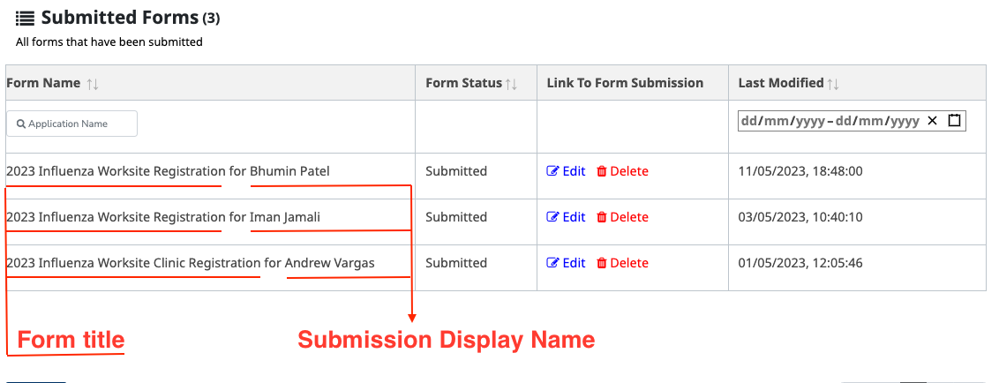

# Forms

## Table of Contents
1. [Calculated Form Values](#calculated-form-values)
   1. [Examples](#examples)
2. [Auto-populate form fields](#how-to-auto-populate-form-fields-with-the-user-data)
3. [Uploading a form](#uploading-a-form)
4. [Form Access](#form-access)
5. [Reusable Popup](#reusable-popup)
6. [Form Retention](#form-retention)
7. [Fetch default values in Draft](#fetch-default-values-in-draft)
8. [Form display name in draft and submission list](#form-display-name-in-draft-and-submission-list)

## Calculated Form Values

If you would like a certain form field to have a calculated value based on the input from previous fields it could potentially require the use of some custom javascript code.

These calculations can be made by selected the field you wish to contain the calculated value and clicking on it's gear icon.
- Navigate to the **Data** tab at the top
- Scroll down to the **Calculated Value** section and click to expand
- This will show some general instructions on how to add calculations



### Examples

#### Telework Calculated "Number of days teleworking in a week"

#### Calculate a value based on the number of boxes checked representing days of the week:

The following code snippet checks each checkbox contained within the `theEmployeesScheduleWillBe` field of the form and adds it to the value of this field if it has been checked.

```
value = Object.keys(data.theEmployeesTeleworkScheduleWillBe).reduce((acc, key) => {
if (data.theEmployeesTeleworkScheduleWillBe[key] === true) {
	acc++
}
return acc;
},0)
```

## How to auto-populate form fields with the user data

If you would like to automatically populate a form's field with the user's data, you can do so by adding one of the pre-defined names to a field in your form. Follow these steps to add the user's data to a field:

Step 1: Look at the pre-defined values along with their names in table below or from `/forms-flow-api/src/formsflow_api/models/employee_data.py` file. These values are available to all forms.

Step 2: When creating forms, in the Form builder dialog for a component, under `API` tab, you can set the `Property Name` of a field. If you want this field to be pre-populated with the user data simply add one of the pre-defined names (found in the last step) as a `Property Name`.

Step 3: If you want to use one piece of user data more than once in a form, you can append `_` to the property name of your field. For example, if you want to use the user's `name` second time in a form, you can set the `Property Name` of the field to be `name_2`.

| Property Name            | Description |
| ------------------------ | ----------- |
| `name`                     | first and last name of employee as retuned from ODS|
| `firstName`                | first name of employee|
| `lastName`                 | last name of employee|
| `displayName`              | A calculated value based on `firstName` + `lastName` of employee|
| `email`                    | email of employee|
| `address1`                 | home address1 of employee|
| `address2`                 | home address2 of employee|
| `officePhone`              | office phone of employee|
| `empId`                    | employee id of employee|
| `positionTitle`            | position title of employee|
| `depId`                    | department id of employee|
| `officeAddress1`           | office address1 of employee|
| `officeAddress2`           | office address2 of employee|
| `officeCity`               | office city of employee|
| `officeCountry`            | office country of employee|
| `officePostal`             | office postal code of employee|
| `officeStateprovince`      | office state or province of employee|
| `organization`             | organization of employee|
| `divisionLevel2`           | level 2 branch/division of employee|
| `supervisorName`           | name of employee's supervisor|
| `supervisorEmail`          | email of employee's supervisor|
| `supervisorPositionTitle`  | position title of employee's supervisor|



## Uploading a form
### Migrating a form to a new environment
  1. For this work, you need a `designer` role in the two environments.
  2. In the first environment you are migrating the form from, download the form by finding the form in the list of forms and clicking `Download Form`. The form will be saved in `JSON` format on your computer.
  3. Go to the target environment:
   - Upload the downloaded form on the `Forms` page through the `Upload Form` button.
    - If there is no previous version of that form in the target environment, the new form will appear in the list of forms.
    - If there is a previous version of that form in the target environment, the new form overwrites the older one. Please note that you don't see any warnings that you're overwriting.
  4. Add the necessary workflow and then publish the form if that is the desired behaviour. 

### Creating a duplicate form
 1. For this work you need a `designer` role.
 2. Download the form you want to duplicate and save it to your computer. The form will be saved in `JSON` format on your computer.
 3. Open the `JSON` file (in a text editor or an online text editor compatible with `JSON` format) and change the following fields. For example, if the form you're duplicating is called `Telework` then change the following fields and save the file:
   - `title`: change it to something else like `Telework-test-1`.
   - `name`: change it to something else like `Telework-test-1`.
   - `path`: change it to something else like `Telework-test-1`.
4. Upload the file to the `Forms` page through the `Upload Form` button. You the will see the new form along with the old form in the list of forms. 
5. Add the necessary workflow and then publish the form if that is the desired behaviour. You can assign the same workflow to the duplicated form or assign a different workflow.

## Form access
A form designer can specify which IDPs (Identity Providers, e.g., IDIR, BCeID and BCSC) forms should support . For example _Telework_ form should only be accessible for IDIR users while _1.10_ form supports IDIR and BCeID among other IDPs. 
A form designer can set one or more supported IDPs for a form thorugh form meta data.Supported IDPs are `idir`, `bceid` and `bcsc`. These IDPs may change in the future. Multiple values are supported and should be separated by a comma `,`.

For example if you want a form to be accessible for IDIR users enter `idir`. If you want to support both IDIR and BCeID, please enter `idir,bceid`.

**Note**: If you make any change in supported IDPs. Please reach to the 3rd step `Preview and Confirm` and click `save` to apply that changes for form and form-list page. 



## Reusable Popup
A reusable popup was added to the TOOL. A form designer can pass the popup content and trigger it with followings:
- A button with `Custom` action. Please add a `button` to your form, select `Custom` under `Action` and add the following code to add the title and body of popup and trigger it:
```javascript
const titleText = `my title`;
const bodyText = `
<h1>My First Heading</h1>
<p>My first paragraph.</p>
`;

form.emit('customEvent', {
    type: "popup",
    component: component,
    title: titleText,
    body: bodyText
});
``` 

Please note that `title` is optional and should be text while `body` is required and support both text and HTML.



The popup will be displayed like the image below:



- Tooltip in `Text Field` and `Text Area`. A form designer can make the tooltip, in the `Text Field` and `Text Area` open in a popup. In order to make tooltip, open as popup, please add `<!-- popup -->` to the first line of tooltip. The content of the tooltip can be text or HTML. 


The popup will be displayed like the image below:




## Form Retention

| Form                      | Draft*       | Incomplete  | Complete    | 
| ------------------------  | ----------- | ----------- | ----------- | 
| `Telework`                | ?           | 60 days     | 60 days     |
| `1.10 Formal Complaint`   | ?           | N/A         | 60 days     |
| `SL Review`               | ?           | ?           | ?           |

\* Unsubmitted drafts
### Description of Workflow States for Forms
- `Telework`
  - Incomplete: After employee submission but before manager review
  - Complete: After manager review
- `1.10 Formal Complaint`
  - Complete: After employee submission
- `SL Review`
  - Incomplete: After initial SL submission
  - Complete: Once the SL submission has been updated and meets the end criteria (which will be discussed and updated here)

## Fetch default values in Draft
In the new form submission, we fetched logged-in users' data and pre-fill in the form.  If we want to fetch the same in the draft edit form, the below settings are required.

1. Make the field `disabled` for which we want to fetch the latest data from the user object.
2. Add the hidden field `enableDraftDefault` and set its value to `true` in the form.

## Form display name in draft and submission list



When we open the submitted form tab, We see a list of submitted forms. In the above image, we can see two parts of "Form name"
- "Form title"
- "Submission Display Name"

Here "Submission Display Name" is varying form to form. And that value is fetched from the submission data only.

let's define steps that prepare "Submission Display Name" value.
1. Add hidden field in form with name `submissionDisplayName`
2. Go to "data" tab and "Calculated Value" section.
3. Add Javascript code that prepare "Submission Display Name" value.

**e.g.**
In Cold/Flu form we are displaying primary contact first and last name. So the script will be.
```javascript
if (data?.primary_first_name && data?.primary_last_name) {
  value = `${data.primary_first_name} ${data.primary_last_name}`;
}
```
