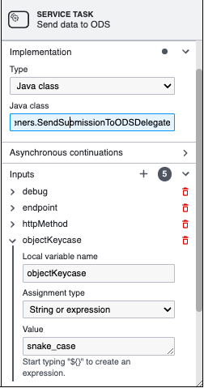

# Forms

## Table of Contents
1. [Convert Key Case](#convert-key-case)
2. [Replace text](#replace-test)

## Convert Key Case

On the request object, ODS expects the key in the snake case instead of the camel case. Added one parameter on the delegate that reads input data and converts keys from camelCase to sname_case.
E.g. firstName (camel case) => first_name (snack case)

To achieve the above requirement, Please add one input param "objectKeycase" on the service task in a workflow that sends data to ODS and passes the value as "snake_case". Please refer below image.

## Replace text

On the request object, ODS expects a single quote to be parsed. or replace some special characters with different data.

To achieve the above requirement, Please add one input param "replaceTextList" on the service task in a workflow that sends data to ODS and passes value as "',''" (Comma separated). Please refer below image.

Format: `<first>,<second>`

Here `<first>` value will be replace by `<second>` value.

E.g.
- If you want to replace `'` single quote with `''` double single quotes. pass `',''` as list value
- If you want to replace `@` with `#`. pass `@,#` as list value
- If you want to do above both. pass list as per below image.

